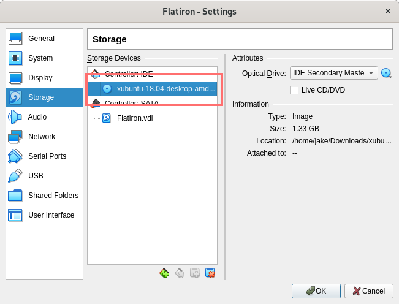
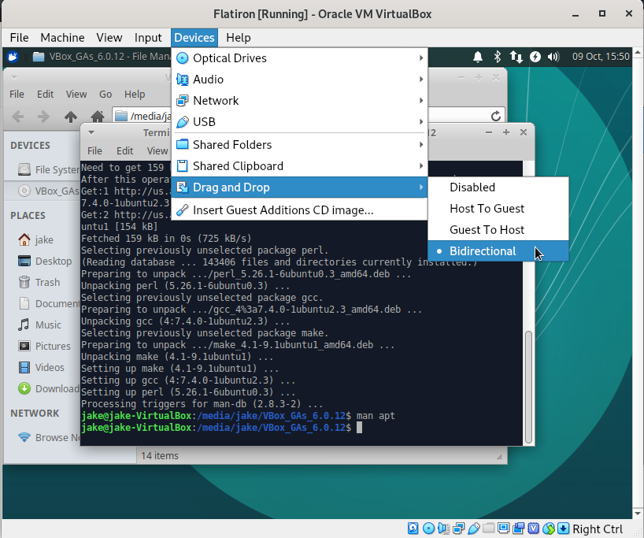

- [Download the XUbuntu install .iso file](#org3423977)
- [Create a new Virtual Machine](#org4136ff3)
- [Boot the VM](#orgcae1c22)
- [Install XUbuntu](#org6ec0997)
- [(Optional) Installing Virtual Box Guest Additions](#org73b18f6)
- [Finalizing your installation](#orgbe82100)
- [Setting up the learn-co gem](#orgd2fc269)
- [Final Steps](#org5f56edf)

# Download the XUbuntu install .iso file

Download XUbuntu for [64-bit](http://mirror.us.leaseweb.net/ubuntu-cdimage/xubuntu/releases/18.04/release/xubuntu-18.04-desktop-amd64.iso) (probably what you want) or [32-bit](http://mirror.us.leaseweb.net/ubuntu-cdimage/xubuntu/releases/18.04/release/xubuntu-18.04-desktop-i386.iso) machines.

# Create a new Virtual Machine

1.  Open `VirtualBox` and click the *New* button:

1.  Give your VM a name and make sure that the *type* is set to *Linux* and *version* is *Ubuntu (64-bit)* or *Ubuntu (32-bit)*:

1.  Select the amount of memory to give your VM. XUbuntu requires **at least** 512 MB of memory, but the more it has, the better it can run. At the same time though you don't want to give it too much or your host system won't have enough. Generally, you don't want to give it more than 1/4 of your total memory:

1.  Make sure that *Create a virtual hard disk now* is selected and click *Create*:

1.  Make sure that *VDI (VirtualBox Disk Image)* is selected and click *Next*:

1.  Make sure that *Dynamically allocated* is selected and click *Next*:

1.  Choose a size to make your virtual hard disk. This must be at least **20 GB**:

You should now see your new VM listed on the left:

# Boot the VM

1.  Click on *Settings* and navigate to the *Storage* section:

1.  Under *Controller: IDE* select the CD icon that says *Empty* next to it. On the right, next to *Optical Drive: IDE Secondary Master* click the CD icon and select *Choose Virtual Optical Disk File*:

1.  Navigate to where your [.iso file](#org3423977) was downloaded, select it, and click *Open*

Next to that CD icon, you should now the name of the [.iso file](#org3423977) you downloaded, instead of *Empty*. Go ahead and click *OK*.

# Install XUbuntu

1.  Look at the column on the left and make sure your new VM is selected. Click *Start*:

1.  When the VM boots up, click *Install Xubuntu*:

1.  Make sure that the language for the keyboard you use is selected and click *Continue*:

1.  Make sure that both check boxes on the *Updates and other software* page are selected and click *Continue*:

1.  Make sure that *Erase disk and install Xubuntu* is selected and click *Install Now*:

1.  Click *Continue* to confirm that you really want to write the changes to disks:

1.  Select your timezone and click *Continue*:

1.  Enter information to create a new user account (make sure you remember the password you create) and click *Continue*:

1.  XUbuntu should now be installing. It might take a little bit:

1.  When the installation finishes, click *Restart Now*:

1.  When it asks you to remove the installation medium, just press *ENTER*:

The VM will now reboot:

# (Optional) Installing Virtual Box Guest Additions

1.  When the VM boots up again. Select *Devices* from the VirtualBox menu bar and then *Insert Guest Additions CD image&#x2026;*:

1.  A virtual CD should be inserted and a *File Manager* window should open:

1.  Right click in the *File Manager* window and select *Open Terminal Here*:

1.  In the terminal run `sudo apt install gcc make perl`

The terminal may ask you for a password. If it does, type the password you for the user account you created earlier. You won't see anything appear on the screen&#x2013;but it is working. Just type the password and hit *Enter*.

It will pause to ask you to confirm that you want to install everything. Just hit *Enter*:

1.  In the terminal, run `sudo ./VBoxLinuxAdditions.rub`:

1.  The script should run and finish without any errors:

1.  Select *Devices* in the VirtualBox menu bar, then *Shared Clipboard*, then *Bidirectional*.

1.  Click the icon in the upper left and hit the log out putting to restart the VM:

# Finalizing your installation

1.  Open the Terminal Emulator:

1.  In the terminal run `wget https://raw.githubusercontent.com/learn-co-students/online-web-pt-081219/master/00-linux-virtual-machine/xubuntu/setup.sh`

1.  Run `chmod +x setup.sh`

1.  Run `./setup.sh`. It will ask you for the password you made when you created your user account. As you type the password, nothing will appear on the screen. Don't worry&#x2013;it is working, just type your password and hit *enter*.

When the script finishes, it should say "AUTO SETUP COMPLETE!!!":

# Setting up the learn-co gem

1.  In a terminal, run `learn whoami`:

1.  Open up a web browser and navigate to <https://learn.co/your-github-username>. My github name is j-shilling, so I'm going to go to <https://learn.co/j-shilling>:

1.  Scroll to the bottom of the page and copy the OAuth Token:

1.  Past that OAuth Token into the terminal:

When you press *Enter* you should see your account information:

# Final Steps

You just about done! All that's left to do is pick out a browser and text editor:

-   Firefox is the default web browser on XUbuntu, but you can install Chrome if you want. Just navigate to the [Google Chrome](https://www.google.com/chrome/) webpage, click *Download Chrome* and select the *64 bit .deb* version.
-   There are several&#x2013;probably&#x2013;thousands of great text editors for programming, but some popular ones are:
    -   [Atom](https://atom.io/)
    -   [Visual Studio Code](https://code.visualstudio.com/)
    -   [Sublime Text](https://www.sublimetext.com/)

When installing new software from the internet, remember to always choice *.deb* packages, or ones that are marked for *Ubuntu* Linux.

Once you have your text editor set up you are ready to learn:

1.  [How to manually open a lab](https://help.learn.co/en/articles/492935-how-to-manually-open-a-lab)
2.  [How to manually submit a lab](https://help.learn.co/en/articles/493057-how-to-manually-submit-a-lab)
